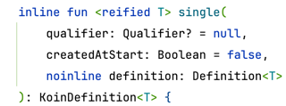
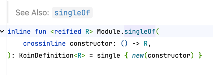

# koin

goal

* Simplify your Dependency Injection infrastructure with smart API
* Kotlin DSL easy to read, easy to use, to let you write any kind of application
* Provides different kind of integration from Android ecosystem, to more backend needs like Ktor
  (안드로이드 생태계로부터 Ktor와 같은 백엔드 요구사항까지 다양한 종류의 통합을 제공)
* Allow to be used with annotations

## 의문점

### koin-androidx-startup

```kotlin
implementation("io.insert-koin:koin-androidx-startup:$koin_android_version")
```

이건 뭐지

### koin annotation

# quickStart

## Repository Module 추가하기

```kotlin
val repositoryModule = module {
    single<ProductRepository> { InMemoryProductRepository() }
}
```


T: 주입할 객체의 base type,
qualifier: 같은 base type 의 객체가 여러개일 때 구분하기 위한 것.
createdAtStart: 언제 생성할지
definition: 실제 구현체

단순히 작성하면

```kotlin
val repositoryModule = module {
    single { InMemoryProductRepository() }
}
```

이런 식으로 할 수 있다.

더 단순히 작성도 가능

```kotlin
val repositoryModule = module {
    singleOf(::InMemoryProductRepository)
}
```



---

그런데 singleOf 로 만들면 DI 컨테이너에 InMemoryProductRepository 타입으로 등록된다.
뭔 소리냐
DI 컨테이너에 타입과 구현체가 등록되는 것인데,
타입은 인터페이스로 등록하고, 구현체는 실제 구현체로 등록하는 것이 일반적이다.

그런데 singleOf 로 하면 타입이 인터페이스가 아닌 구현체의 타입 자체가 등록된다.
그래서 타입이 InMemoryProductRepository 로 등록된다.

그렇다면 singleOf 를 사용하면서 타입은 인터페이스로 사용하려면?
아쉽게도 아래처럼 써야 함.

```kotlin
singleOf(::InMemoryProductRepository) { bind<ProductRepository>() }
```

이렇게 할 바에 차라리 single 을 사용하는 게 나을 것 같다.

viewModelOf 와 viewModel 도 똑같다!

일반적으로 ViewModel 은 인터페이스와 구현체를 직접 따로 만들지 않는 경우가 많다.
그래서 viewModelOf 를 쓰는 건 더 간편할 지도?

신기한 점:
singleOf(::InMemoryProductRepository)
이렇게 했을 InMemoryProductRepository 의 생성자 파라미터가 0개 이면

```kotlin
inline fun <reified R> Module.singleOf(
    crossinline constructor: () -> R,
): KoinDefinition<R> = single { new(constructor) }
```

1개이면

```kotlin
inline fun <reified R, reified T1> Module.singleOf(
    crossinline constructor: (T1) -> R,
): Pair<Module, InstanceFactory<R>> = single { new(constructor) }
```

3 개이면,

```kotlin
inline fun <reified R, reified T1, reified T2, reified T3, reified T4> Module.singleOf(
    crossinline constructor: (T1, T2, T3, T4) -> R,
    options: BeanDefinition<R>.() -> Unit
): KoinDefinition<R> {
    return setupInstance(_singleInstanceFactory(definition = { new(constructor) }), options)
}
```

일로 Declaration(cmd + B) 이 연결된다.

```kotlin
single<ProductRepository> { InMemoryProductRepository() }

```

그런데 만약 생성자 파라미터가 필요한 모듈이라면?
레포지토리가 dao 를 생성자 파라미터로 갖는다면?

```kotlin
val repositoryModule = module {
    single<CartRepository> { LocalCartRepository(get()) }
    single<ProductRepository> { InMemoryProductRepository() }
}
```

액티비티 스코프 dateFormatter

```kotlin
class CartActivity : AppCompatActivity() {
    private val scope = getKoin().createScope("CartActivityScope", named<CartActivity>())
    //...

    override fun onDestroy() {
        super.onDestroy()
        scope.close()
    }
}
class TodayFragment : Fragment() {
    private val dateFormatter: DateFormatter by lazy {
        getKoin().getScope("CartActivityScope").get()
    }
    // ...
}
class CartFragment : Fragment() {
    private val dateFormatter: DateFormatter by lazy {
        getKoin().getScope("CartActivityScope").get()
    }
    // ...
}

val myAppModules = module {
    scope<CartActivity> {
        scoped<DateFormatter> { KoreanLocaleDateFormatter(get()) }
    }
}
```

이렇게 하면 KoreanLocaleDateFormatter 가 CartActivity 의 스코프에 등록된다.
그리고 각 두 프래그먼트는 CartActivity 의 스코프에서 dateFormatter 를 가져올 수 있다.

